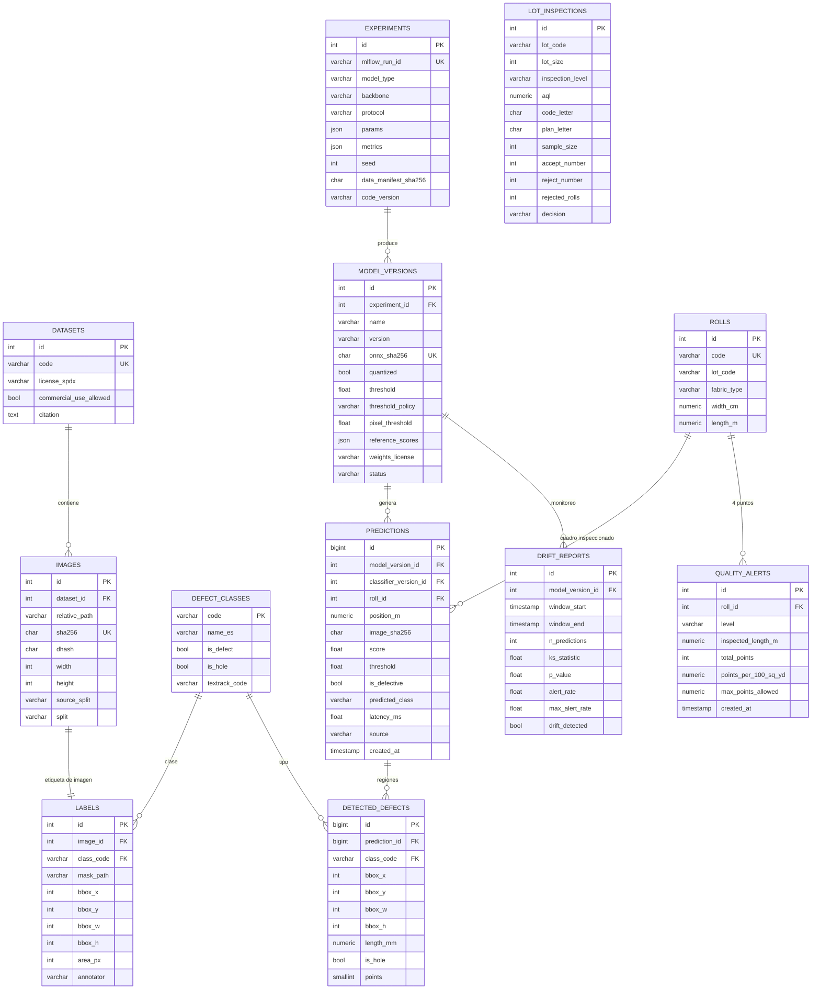

# Modelo de datos

Derivado de las fuentes de [investigacion.md](investigacion.md) (los números `#n` y `Sn` apuntan a esa tabla). Motor: **SQLite** en local y **PostgreSQL (Neon)** en despliegue, con el mismo esquema vía SQLAlchemy 2 y migraciones **Alembic** versionadas (`batch mode` para SQLite). Los nombres de tablas y columnas van en inglés.

## Diagrama ER



`LOT_INSPECTIONS` se relaciona con `ROLLS` por `lot_code` (un lote = un envío de rollos), sin clave foránea, porque el lote puede traer rollos que aún no están registrados.

## Tablas y campos

| Tabla | Campo | Tipo | Restricción | Regla / fuente |
|---|---|---|---|---|
| datasets | code | varchar(40) | único; p. ej. `mvtec_ad_carpet` | R1 |
| datasets | name, version, source_url, license_url | varchar | no nulos | #1, #2 |
| datasets | license_spdx | varchar(40) | `CC-BY-NC-SA-4.0`, `CC-BY-4.0`… | R1 (#1, #5) |
| datasets | commercial_use_allowed, redistribution_allowed | bool | no nulos | R1 |
| datasets | citation | text | no nulo (cita obligatoria) | #1, #3 |
| images | dataset_id | FK → datasets | no nulo | R1 |
| images | relative_path | varchar(300) | único por dataset; relativo a `data/raw/` | R2 |
| images | sha256 | char(64) | **único** (sin duplicados exactos) | R2 |
| images | dhash | char(16) | hash perceptual de 64 bits (casi duplicados) | R2 |
| images | width, height | int | > 0 | — |
| images | source_split | varchar(10) | `train`, `test` (partición oficial de MVTec) | Protocolo A (#3) |
| images | split | varchar(5) | `train`, `val`, `test` (partición estratificada propia) | R2, Protocolo B |
| defect_classes | code | varchar(30) PK | `good`, `color`, `cut`, `hole`, `metal_contamination`, `thread` | #1 (tipos de carpet) |
| defect_classes | is_defect / is_hole | bool | solo `hole` tiene `is_hole = true` | R4 (#11, S5) |
| defect_classes | textrack_code | varchar(20) | código que se manda a textrack (≤ 20 caracteres) | Integración textrack |
| labels | image_id | FK → images | **único** (una etiqueta de imagen) | — |
| labels | class_code | FK → defect_classes | no nulo | — |
| labels | mask_path, bbox_*, area_px | varchar, int | nulos solo si `class_code = good`; bbox dentro de la imagen | #3 (máscaras por píxel) |
| labels | annotator | varchar(40) | seudónimo (`mvtec`, `annotator_01`); nunca nombres reales | LOPDP: minimización |
| experiments | mlflow_run_id | varchar(32) | único; enlaza con MLflow | R10 |
| experiments | model_type | varchar(20) | `classifier`, `patchcore` | #15, #16 |
| experiments | protocol | varchar(20) | `mvtec_official`, `stratified` | R2 |
| experiments | params, metrics | json | hiperparámetros; AUPRC, AUROC, F1 por clase, IC 95 % | #17, #18 |
| experiments | seed | int | no nulo | R10 (#25) |
| experiments | data_manifest_sha256, code_version | char(64), varchar(40) | hash del manifiesto de datos y commit de git | R10 |
| model_versions | version | varchar(20) | semver; único junto a `name` | — |
| model_versions | onnx_sha256 | char(64) | **único**; se verifica antes de cargar el modelo | R9 (#30 ML06) |
| model_versions | quantized | bool | INT8 estático QDQ | #27 |
| model_versions | threshold, threshold_policy | float, varchar(20) | umbral elegido en **val** (`max_f1_val`, `recall_95_val`, `p99_normal_val`) | R3 (#3, #19) |
| model_versions | pixel_threshold | float | umbral de píxel elegido en val (máximo F1 de píxel) para delimitar regiones | R3 |
| model_versions | reference_scores | json | puntajes de las imágenes **buenas** de validación (referencia del drift) | R8 |
| model_versions | weights_license | varchar(40) | `CC-BY-NC-SA-4.0` | S6 |
| model_versions | status | varchar(12) | `candidate`, `production`, `archived`; **solo uno `production` por `name`** (índice único parcial) | — |
| rolls | code | varchar(30) | único; datos **ficticios** (`RL-2026-0001`) | — |
| rolls | width_cm | numeric(6,1) | 30–400 (mismo rango que textrack) | Integración textrack |
| rolls | length_m | numeric(8,2) | > 0 | R6 |
| predictions | model_version_id | FK → model_versions | detector (PatchCore) que dio el puntaje; no nulo | R11 |
| predictions | classifier_version_id | FK → model_versions | clasificador que nombró el tipo | R11 |
| predictions | roll_id, position_m | FK, numeric(8,2) | opcionales; si hay rollo, `0 ≤ position_m ≤ length_m` | R5, R6 |
| predictions | image_sha256 | char(64) | se guarda el hash, **no la imagen** | R12 (#29, minimización) |
| predictions | score, threshold, is_defective | float, float, bool | `is_defective = score ≥ threshold`; se copia el umbral usado (auditable) | R3, R11 |
| predictions | predicted_class, class_confidence | varchar, float | clase del clasificador; nulo si no hay defecto | #16 |
| predictions | latency_ms | float | > 0; tiempo medido de inferencia | MVP |
| predictions | source | varchar(10) | `api`, `batch`, `seed` | — |
| detected_defects | bbox_*, length_mm | int, numeric(8,1) | `length_mm = max(bbox_w, bbox_h) × MM_PER_PIXEL` | R4 (S1) |
| detected_defects | is_hole, points | bool, smallint | 1 ≤ points ≤ 4 | R4 (#11, S4, S5) |
| quality_alerts | level | varchar(10) | `WARNING` (≥ 80 % del límite) o `REJECTED` (> límite) | R6 (S3) |
| quality_alerts | total_points, points_per_100_sq_yd, max_points_allowed | int, numeric(8,2) | ≥ 0 | R5, R6 (#11) |
| lot_inspections | lot_size / inspection_level / aql | int, varchar, numeric | lote ≥ 2; niveles `S-1…S-4, I, II, III`; AQL 0,10–6,5 | R7 (#12, #13) |
| lot_inspections | code_letter, plan_letter, sample_size, accept_number, reject_number | char, int | letra de la Tabla I, letra del plan tras seguir las flechas y (n, Ac, Re) de la Tabla II-A | R7 (#13) |
| lot_inspections | decision | varchar(10) | `ACCEPTED` si rollos rechazados ≤ Ac; si no, `REJECTED` | R7 |
| drift_reports | ks_statistic, p_value, alert_rate, max_alert_rate | float | KS de dos muestras (tela normal) contra `reference_scores` y tasa de alertas frente a su límite | R8 (#20) |

## Reglas de negocio

| Regla | Descripción | Fuente |
|---|---|---|
| R1 · Licencias | Toda imagen pertenece a un dataset con licencia registrada. Solo se cargan los que permiten el uso (carpet, CC BY-NC-SA 4.0). Las imágenes no se versionan; los pesos heredan CC BY-NC-SA 4.0. | #1, #5–#9, S6 |
| R2 · Sin fuga de datos | La partición se asigna **por imagen** antes de cualquier aumento o recorte, estratificada por clase y con semilla fija. Un test automático falla si un `sha256` o un `dhash` a distancia de Hamming ≤ 4 aparece en dos particiones. La normalización usa las medias de ImageNet, no estadísticas del test. | #19, #3 |
| R3 · Umbral | El umbral se elige **solo en validación** y se reporta en test. Política por defecto `max_f1_val`; se reportan también `recall_95_val` y `p99_normal_val` (umbral solo con imágenes buenas, como recomienda MVTec). | #3, #19 |
| R4 · Puntos por defecto | Longitud ≤ 76,2 mm → 1; ≤ 152,4 → 2; ≤ 228,6 → 3; > 228,6 → 4; **agujero → 4**. | #11, S4, S5 |
| R5 · Tope por yarda | Máximo 4 puntos por yarda lineal (0,9144 m) al totalizar el rollo. | S2 |
| R6 · Decisión del rollo | `puntos/100 yd² = puntos × 3600 / (largo_yd × ancho_in)`. Rechazo si supera `MAX_POINTS_PER_100_SQ_YD` (40 por defecto); `WARNING` desde el 80 %. | #10 §1.2, #11, S3 |
| R7 · Decisión del lote (AQL) | Letra código por Tabla I (nivel II por defecto) → plan (n, Ac, Re) por Tabla II-A siguiendo las flechas. Si n ≥ lote, inspección 100 %. Un rollo rechazado por R6 es una unidad defectuosa. | #12, #13 |
| R8 · Drift | Ventana por defecto: las últimas 200 predicciones, con un mínimo de 30 de tela normal. Dos señales: (1) **KS de dos muestras** entre los puntajes bajo el umbral (tela que parece normal) y los de las imágenes buenas de validación; hay drift si `p < 0,01`. Así, más defectos reales no se confunden con drift, pero un cambio de cámara, iluminación o tela sí se detecta. (2) **Tasa de alertas** por encima de 25 %, que pide revisión humana. | #20, #30 ML01 |
| R9 · Integridad del modelo | El ONNX se descarga del release y solo se carga si su SHA-256 coincide con `model_versions.onnx_sha256`. Nunca se deserializan *pickles* no confiables. | #30 ML06, #37 |
| R10 · Reproducibilidad | Cada experimento registra la semilla, el hash del manifiesto de datos, el commit y las versiones fijadas (`uv.lock`). Las métricas del README salen de `reports/metrics.json`, generado por el pipeline en CPU. | #25 |
| R11 · Trazabilidad | Cada predicción guarda la versión del modelo, el umbral vigente y la latencia medida. | MVP |
| R12 · Entrada segura | Solo PNG/JPEG detectados por contenido (no por extensión ni `Content-Type`), ≤ 5 MB, ≤ 4096×4096 px. La imagen no se guarda: solo su hash. | #29 API4, #31, S14 |

## Protocolos de evaluación

- **Protocolo A (`mvtec_official`)**: PatchCore entrenado con `train/good` y evaluado en el `test` oficial. Solo sirve para comprobar que mi implementación reproduce el orden de magnitud publicado (#15). No se usa para elegir el umbral.
- **Protocolo B (`stratified`)**: las 397 imágenes esperadas de *carpet* (el conteo exacto lo fija el manifiesto al descargar) se reparten por imagen y estratificadas por clase: buenas 60/20/20 y defectuosas 40/20/40 (train/val/test). El clasificador supervisado entrena con `train` (buenas + defectuosas); PatchCore usa solo las buenas de `train`. **Ambos se evalúan sobre el mismo `test`**, con el umbral elegido en `val` → comparación honesta. El test es pequeño (~35 defectos), así que se reporta un **intervalo de confianza al 95 % por bootstrap** (semilla fija) para la AUPRC.

## Datos, artefactos y versiones

```
data/raw/            # imágenes descargadas (gitignored)
data/processed/      # imágenes redimensionadas a 256 px (gitignored)
data/manifest/       # CSV versionado: ruta, sha256, dhash, clase, source_split, split
models/              # *.onnx (gitignored); models/registry.json versionado (versión, sha256, tamaño, URL del release, métricas)
reports/             # metrics.json y figuras (PR, matriz de confusión, mapas de calor) versionadas
mlruns/ o mlflow.db  # tracking local de MLflow (gitignored)
```

Se usan **hashes + manifiesto** en lugar de DVC: el dataset es público y se baja de una URL fija, así que basta con verificar el SHA-256. DVC exigiría configurar un remoto de almacenamiento que no aporta nada aquí. Los pesos van en **GitHub Releases** (< 2 GiB por archivo, #37).

## Catálogos y datos de ejemplo (seeds)

- **Catálogos en la migración**: `defect_classes` (6 clases de carpet con su `textrack_code`) y `datasets` (MVTec AD carpet con licencia y cita).
- **Seeds ficticios**: 10 rollos (`RL-2026-0001…0010`, 150 cm de ancho, 50–100 m, lotes `LT-2026-01/02`), predicciones simuladas que ubican imágenes del test en posiciones del rollo, y las alertas y el plan AQL que resultan. Sin datos personales; los anotadores son seudónimos.
